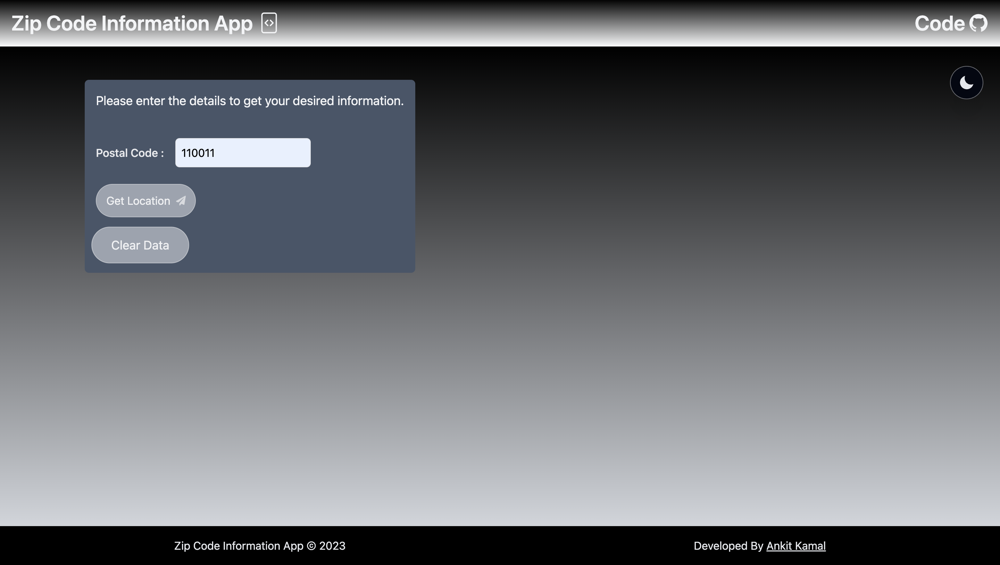
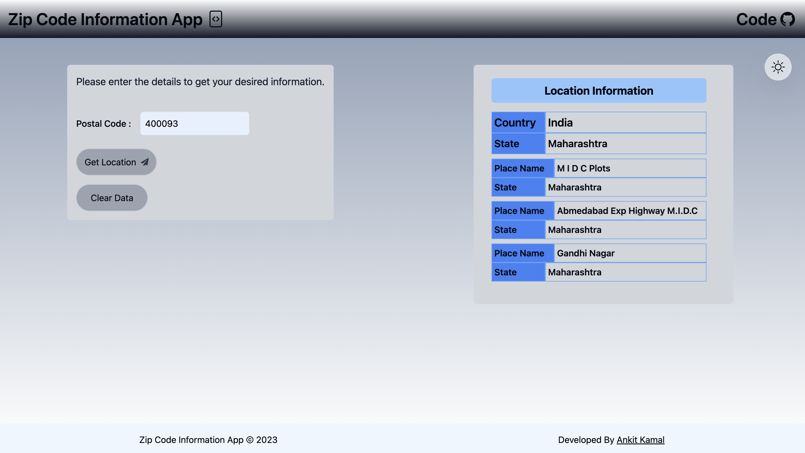

## Zip Code Information App

### Deployment on vercel: https://zip-code-information-app-react.vercel.app/

### Technologies Used

- Front-end:
  `React + Vite`
  `Redux`
  `Tailwind CSS`
  `JavaScript`

- API Integration : `zippopotam.us`

### Screenshot

- Form for entering the ZIP code with dark mode

    

- Location Data from Zip code with light mode

     

---

## Setup the project

1. Fork the project
2. Clone project
3. Install dependencies `npm install`
4. To run the server execute `npm run dev`

---

### Implemented a Redux store to manage the application's state.

1. Location Data -> is stored and managed by redux store.
2. Dark Mode feature is implemented using redux store.
